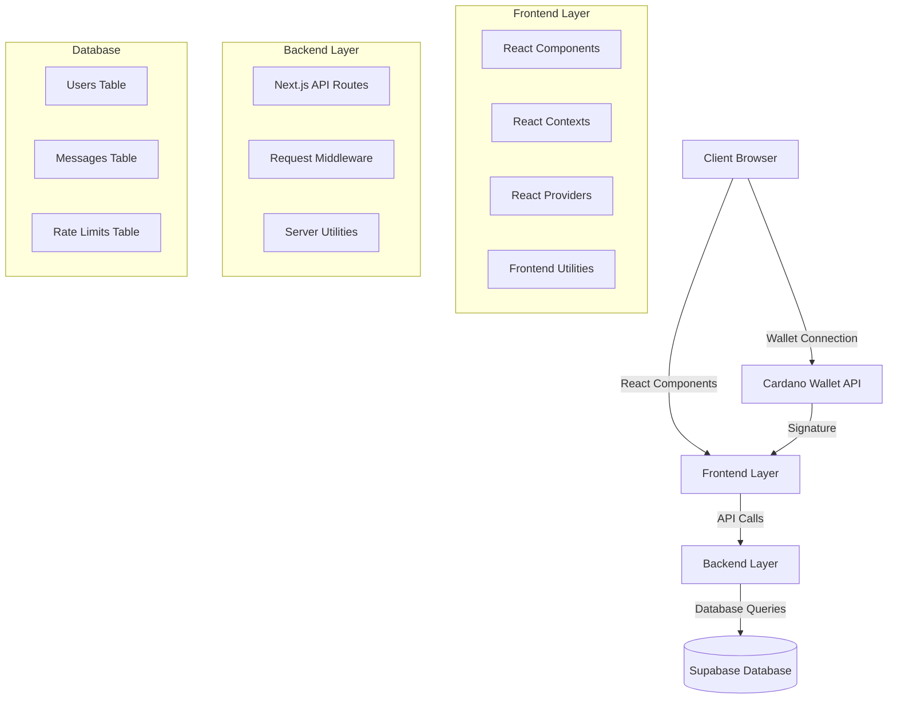
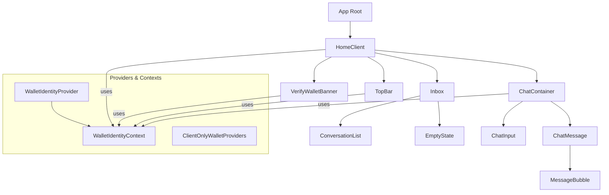
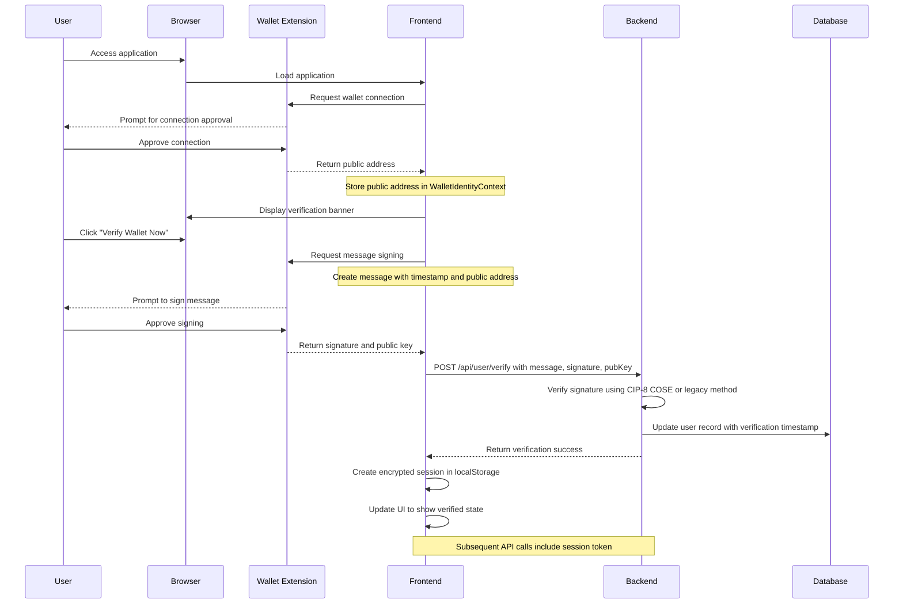
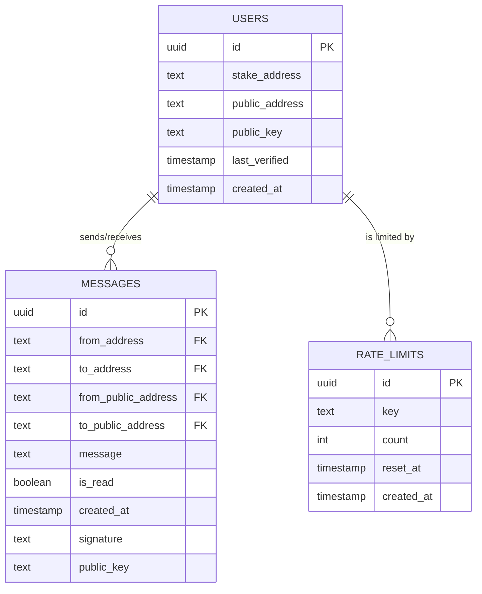
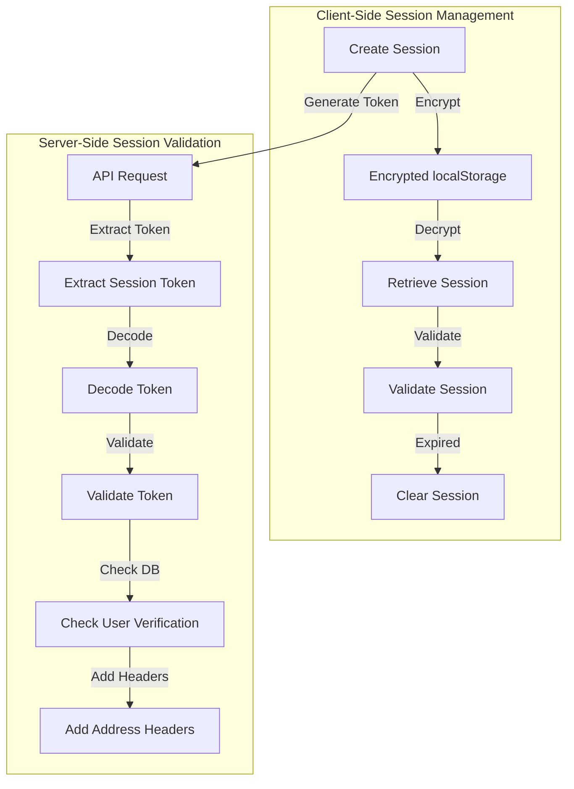
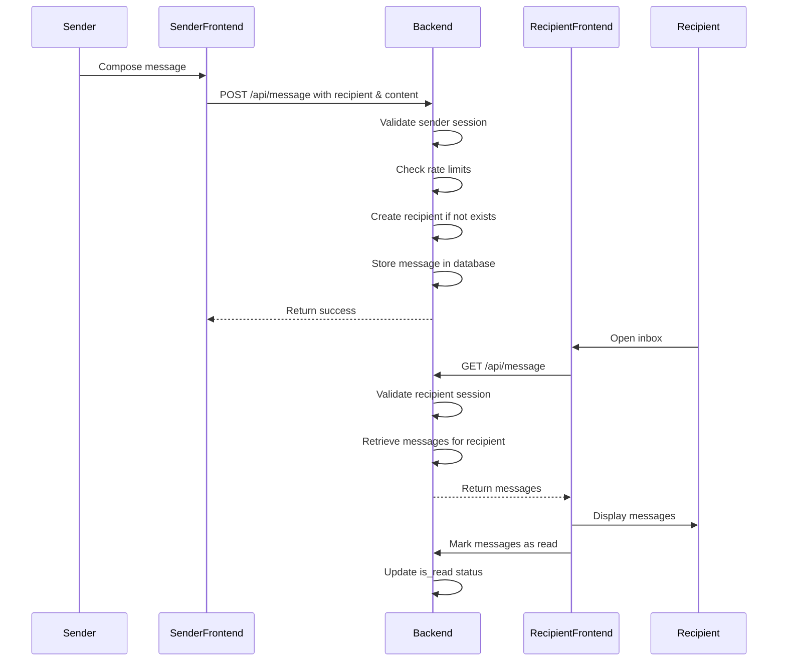

# Wallet-Chat Application Architecture Schema

## 1. Overall Architecture

## 2. Component Relationships

## 3. Authentication & Verification Flow

## 4. Database Schema

## 5. Session Management & Security

## 6. Migration from Stake to Public Addresses

```mermaid
graph TD
    subgraph "Database Migration"
        AddColumns[Add Public Address Columns] --> UpdateIndexes[Update Indexes]
        UpdateIndexes --> UpdatePolicies[Update RLS Policies]
        UpdatePolicies --> MigrationFunction[Create Migration Function]
        MigrationFunction --> ExecuteMigration[Execute Migration]
    end
    
    subgraph "Code Changes"
        UpdateContext[Update WalletIdentityContext] --> UpdateComponents[Update UI Components]
        UpdateComponents --> UpdateAPIs[Update API Routes]
        UpdateAPIs --> UpdateMiddleware[Update Middleware]
    end
    
    subgraph "Verification Process Changes"
        OldVerification[Stake Address Verification] --> NewVerification[Public Address Verification]
        NewVerification --> DualSupport[Support Both Address Types]
        DualSupport --> PrioritizePublic[Prioritize Public Addresses]
    end
```

## 7. Message Flow

## 8. Verification Process Issues

The main issue with the verification process appears to be a mismatch between the updated WalletIdentityContext (which uses `publicAddress`) and the components that still reference `stakeAddress`. This is likely due to the migration from stake addresses to public addresses.

### Key Issues:

1. **Component-Context Mismatch**: 
   - The VerifyWalletBanner component checks for `stakeAddress` but the context now provides `publicAddress`
   - The HomeClient component also uses `stakeAddress` from the context

2. **Verification Button Not Appearing**:
   - Due to the mismatch, the condition `if (!stakeAddress || isVerified)` in VerifyWalletBanner is likely evaluating to true (since `stakeAddress` is undefined), causing the banner not to render

3. **Migration Challenges**:
   - The application is in a transitional state between stake address and public address authentication
   - Some components haven't been fully updated to use the new public address system

### Verification Process (Theoretical Correct Flow):

1. User connects wallet through Cardano wallet API
2. Application retrieves public address from wallet
3. VerifyWalletBanner displays when public address is available but not verified
4. User clicks "Verify Wallet Now" button
5. Application requests wallet to sign a message containing the public address
6. Signed message is sent to backend for verification
7. Backend verifies signature using either CIP-8 COSE or legacy method
8. On successful verification, user record is updated and session is created
9. UI updates to show verified state

## 9. Security Considerations

1. **Client-Side Security**:
   - Sessions are encrypted using AES-GCM before storing in localStorage
   - Device fingerprinting is used to derive encryption keys
   - Sessions expire after 1 hour

2. **Server-Side Security**:
   - Rate limiting prevents brute force attacks
   - Row-Level Security (RLS) in database ensures users can only access their own data
   - Signature verification ensures message authenticity

3. **Address Security**:
   - Migration from stake to public addresses improves security by:
     - Preventing impersonation (stake addresses are publicly visible)
     - Providing unique identification per wallet
     - Requiring proof of ownership through signature verification